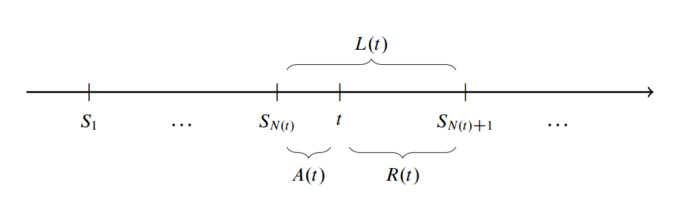

## 更新过程
令$X_i$为一系列的独立同分布，令$S_n=\sum_{i=1}^n X_i$，则定义更新过程为：
$$
N(t)=sup\left \{ n \geq 0|S_n \leq t \right \}
$$

Age Process：
$$
A(t)=t-S_{N(t)}
$$

Residual Process:
$$
R(t)=S_{N(t)+1} - t
$$

Length Process:
$$
L(t)=A(t)+R(t)=S_{N(t)+1}-S_{N(t)}=X_{N(t)+1}
$$

